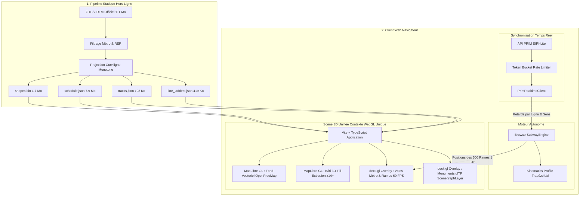

# 🏗️ Architecture Globale du Projet — Métro Parisien 3D

Ce document détaille l'architecture logicielle, les choix techniques fondamentaux, les flux de données et la stratégie de performance du visualiseur 3D du métro parisien.

---

## 1. Vision & Contraintes Fondatrices

### La problématique des données de transport à Paris
Contrairement aux réseaux ferroviaires néerlandais (ex: NS / treinen.pointful.com) ou suisses qui diffusent des coordonnées GPS en direct (`GTFS-RT VehiclePositions`), **la RATP et Île-de-France Mobilités ne diffusent aucune position GPS des rames de métro**.

Ce qui est publiquement disponible :
1. **Les horaires théoriques et tracés géométriques** : flux statique GTFS IDFM (~30 jours glissants).
2. **Les prochains passages estimés par station** : flux temps réel API PRIM (`SIRI-Lite EstimatedTimetable`), par arrêt, sans géolocalisation de véhicule.

### La solution architecturale
Pour offrir une expérience fluide affichant des centaines de rames en mouvement en temps réel, l'application met en œuvre une **simulation cinématique autonome in-browser** recalée en continu par les estimations de l'API PRIM :

---

## 2. Découpage par Modules & Responsabilités

### 1. Module d'Ingestion & Normalisation (`ingest/` & `scripts/`)
- **Rôle** : transformer le GTFS brut volumineux et complexe en artefacts hautement compressés, directement exploitables par le navigateur sans backend lourd.
- **Technologies** : Python 3, Shapely (géométrie vectorielle), SQLite (index relationnel), NumPy.
- **Artefacts produits** :
  - `lines.json` : 16 lignes avec identifiants, codes couleurs autoritaires et décalages altimétriques.
  - `stations.json` : 321 stations consolidées avec coordonnées WGS84 et correspondances.
  - `shapes.bin` : buffer binaire pur (`Float32Array`) pour une lecture mémoire instantanée sans parsing JSON.
  - `tracks.json` : polylignes simplifiées à tolérance sub-métrique (108 Ko, réduction de 98.9 % par rapport au GeoJSON brut).
  - `schedule.json` : extraction des 11 252 courses actives de la journée parisienne.
  - `line_ladders.json` : arborescence ordonnée des stations pour chaque ligne et terminus.
  - `/models/*.glb` : 8 modèles 3D glTF binaires optimisés Z-up pour les monuments parisiens (203 Ko cumulés).

### 2. Moteur de Simulation Cinématique (`web/src/sim/`)
- **Rôle** : calculer à chaque seconde la position curviligne, la vitesse et le cap de chaque rame active.
- **Fichiers clés** :
  - `browser_engine.ts` : boucle cadencée à 1 Hz (`setInterval`), calcul de l'heure légale de Paris, filtrage des courses actives.
  - `kinematics.ts` : interpolation par profil cinématique trapézoïdal (accélération, vitesse de croisière, freinage doux, temps de stationnement).
  - `shapes.ts` : décodeur haute performance du buffer binaire `shapes.bin` via `DataView`.
  - `prim_client.ts` : client HTTP interrogeant l'API PRIM avec lissage exponentiel des retards.

### 3. Scène Cartographique & Bâti 3D Unifié (`web/src/map/`)
- **Rôle** : rendu cartographique unifié haute performance sur un **seul contexte WebGL**.
- **Technologies** : MapLibre GL JS (fond vectoriel OpenFreeMap + bâti 3D `fill-extrusion`) + deck.gl (infrastructure métropolitaine et monuments glTF).
- **Couches & composants** :
  - `vector_style.ts` : style sombre industriel conforme à `tokens.css`, couche `building-3d` avec extrusion conditionnelle et masquage des emprises de monuments.
  - `deck_overlay.ts` : gestionnaire de couches deck.gl synchronisé sur la caméra MapLibre (`interleaved: false`).
  - `trains_layer.ts` : rendu en capsule 5 couches métriques des rames à 60 FPS.
  - `landmarks_layer.ts` : instanciation dynamique des 8 monuments glTF via `ScenegraphLayer` avec filtrage d'emprise géographique.

### 4. Interface Utilisateur & Navigation (`web/src/ui/` & `web/src/state/`)
- **`dock.ts`** : « Le Quai », volet latéral escamotable (desktop) et bottom sheet tactile (smartphone).
- **`station_ladder.ts`** : diagramme de marche vertical avec suivi des rames en approche et calcul de l'intervalle (*headway*).
- **`search_bar.ts`** : champ de recherche de stations instantané avec autocomplétion floue (`⌘K`).
- **`router.ts`** : gestion de l'historique de navigation HTML5 (`/ligne/:short_name?dir=:dir`) avec réécriture Netlify `_redirects`.
- **Barre monuments (`#studio-nav-bar`)** : pilotage caméra cinématique fluide vers les monuments parisiens (`map.flyTo()`).

---

## 3. Stratégie de Performance & Optimisation Réseau

### 1. Suppression du GeoJSON brut (Gain : -9.3 Mo)
Le fichier initial `control_network.geojson` pesait **9.45 Mo**. Il a été remplacé par un fichier dédié `tracks.json` de **107.9 Ko** (-98.9 %) grâce à une simplification de géométrie Shapely (`tolerance = 0.00008`), permettant un chargement instantané de la carte sur mobile.

### 2. Élimination de Three.js & Contexte WebGL Unique (Gain : -634 Ko JS, -275 Ko Data)
L'ancien Studio Three.js créait un second contexte WebGL lourd et concurrent. Sa suppression a permis d'éliminer :
- Le runtime Three.js et ses shaders (~634 Ko de JS minifié en moins).
- L'ancien maillage statique JSON `paris_urban_mesh.json` (275 Ko éliminés).
- Tout risque de conflit GPU ou de perte de contexte WebGL (*context loss*).

### 3. Extrusion Vectorielle Native GPU & glTF à la Demande (60 FPS)
Le bâti 3D parisien est désormais généré à la volée par le moteur de tuiles vectorielles de MapLibre en un seul passage GPU via la primitive `fill-extrusion`. Les 8 monuments emblématiques sont quant à eux distribués en modèles glTF binaires ultra-légers (5 à 62 Ko chacun) et instanciés uniquement lorsque la caméra s'en approche (`zoom >= 13`), garantissant 60 FPS constants sans saccade.

---

## 4. Sécurité & Bonnes Pratiques

- **Clés d'API & Secrets** : la clé d'API PRIM et les tokens de déploiement sont injectés via des variables d'environnement ou gérés dans des fichiers isolés exclus du contrôle de version git (`.gitignore`).
- **Isolation Sandbox** : les opérations d'ingestion et de build s'exécutent dans un environnement bac à sable local sécurisé.
- **Neutralisation des scripts tiers** : blocage strict des scripts d'injection publicitaire ou de widgets d'analytics invasifs au niveau du proxy et du DOM.
