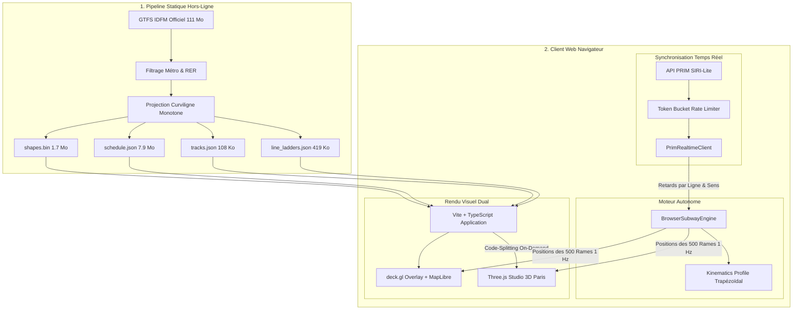

# 🏗️ Architecture Globale du Projet — Métro Parisien 3D

Ce document détaille l'architecture logicielle, les choix techniques fondamentaux, les flux de données et la stratégie de performance du visualiseur 3D du métro parisien.

---

## 1. Vision & Contraintes Fondatrices

### La problématique des données de transport à Paris
Contrairement aux réseaux ferroviaires néerlandais (ex: NS / treinen.pointful.com) ou suisses qui diffusent des coordonnées GPS en direct (`GTFS-RT VehiclePositions`), **la RATP et Île-de-France Mobilités ne diffusent aucune position GPS des rames de métro**.

Ce qui est publiquement disponible :
1. **Les horaires théoriques et tracés géométriques** : flux statique GTFS IDFM (~30 jours glissants).
2. **Les prochains passages estimés par station** : flux temps réel API PRIM (`SIRI-Lite EstimatedTimetable`), par arrêt, sans géolocalisation de véhicule.

### La solution architecturale
Pour offrir une expérience fluide affichant des centaines de rames en mouvement en temps réel, l'application met en œuvre une **simulation cinématique autonome in-browser** recalée en continu par les estimations de l'API PRIM :



---

## 2. Découpage par Modules & Responsabilités

### 1. Module d'Ingestion & Normalisation (`ingest/` & `scripts/`)
- **Rôle** : transformer le GTFS brut volumineux et complexe en artefacts hautement compressés, directement exploitables par le navigateur sans backend lourd.
- **Technologies** : Python 3, Shapely (géométrie vectorielle), SQLite (index relationnel), NumPy.
- **Artefacts produits** :
  - `lines.json` : 16 lignes avec identifiants, codes couleurs autoritaires et décalages altimétriques.
  - `stations.json` : 321 stations consolidées avec coordonnées WGS84 et correspondances.
  - `shapes.bin` : buffer binaire pur (`Float32Array`) pour une lecture mémoire instantanée sans parsing JSON.
  - `tracks.json` : polylignes simplifiées à tolérance sub-métrique (108 Ko, réduction de 98.9 % par rapport au GeoJSON brut).
  - `schedule.json` : extraction des 11 252 courses actives de la journée parisienne.
  - `line_ladders.json` : arborescence ordonnée des stations pour chaque ligne et terminus.
  - `paris_urban_mesh.json` : géométrie 3D de Paris (Seine, îles, ponts, immeubles haussmanniens).

### 2. Moteur de Simulation Cinématique (`web/src/sim/`)
- **Rôle** : calculer à chaque seconde la position curviligne, la vitesse et le cap de chaque rame active.
- **Fichiers clés** :
  - `browser_engine.ts` : boucle cadencée à 1 Hz (`setInterval`), calcul de l'heure légale de Paris, filtrage des courses actives.
  - `kinematics.ts` : interpolation par profil cinématique trapézoïdal (accélération, vitesse de croisière, freinage doux, temps de stationnement).
  - `shapes.ts` : décodeur haute performance du buffer binaire `shapes.bin` via `DataView`.
  - `prim_client.ts` : client HTTP interrogeant l'API PRIM avec lissage exponentiel des retards.

### 3. Couche Cartographique 2.5D (`web/src/map/`)
- **Rôle** : rendu cartographique interactif avec vue aérienne et perspective inclinée.
- **Technologies** : MapLibre GL JS (fond de carte vectoriel Esri Dark Gray) + deck.gl (couches WebGL haute densité).
- **Couches deck.gl** :
  - `PathLayer` : extrusion 3D des voies avec décalage en Z pour les croisements sous-sol.
  - `ScatterplotLayer` : stations et rames (corps blanc porcelaine + cœur coloré + bague dorée temps réel).
  - `TextLayer` : étiquettes 3D des stations au survol et filtrage d'une ligne.

### 4. Studio 3D Paris (« Ville Lumière ») (`web/src/three/`)
- **Rôle** : maquette 3D architecturale nocturne de Paris.
- **Technologies** : Three.js, OrbitControls, `THREE.InstancedMesh`.
- **Composants** :
  - `paris_scene.ts` : gestion de la scène, sol en ardoise blueprint semi-translucide, surface miroitante de la Seine, ponts 3D, skyline de La Défense, tubes néon du métro, rames 3D avec phares.
  - `landmarks.ts` : modèles 3D paramétriques des monuments (Tour Eiffel avec son phare rotatif 360°, Sacré-Cœur, Arc de Triomphe, etc.).

### 5. Interface Utilisateur & Navigation (`web/src/ui/` & `web/src/state/`)
- **`dock.ts`** : « Le Quai », volet latéral escamotable (desktop) et bottom sheet tactile (smartphone).
- **`station_ladder.ts`** : diagramme de marche vertical avec suivi des rames en approche et calcul de l'intervalle (*headway*).
- **`search_bar.ts`** : champ de recherche de stations instantané avec autocomplétion floue (`⌘K`).
- **`router.ts`** : gestion de l'historique de navigation HTML5 (`/ligne/:short_name?dir=:dir`) avec réécriture Netlify `_redirects`.

---

## 3. Stratégie de Performance & Optimisation Réseau

### 1. Suppression du GeoJSON brut (Gain : -9.3 Mo)
Le fichier initial `control_network.geojson` pesait **9.45 Mo**. Il a été remplacé par un fichier dédié `tracks.json` de **107.9 Ko** (-98.9 %) grâce à une simplification de géométrie Shapely (`tolerance = 0.00008`), permettant un chargement instantané de la carte sur mobile.

### 2. Code-Splitting Dynamique de Three.js (Gain : -570 Ko)
Three.js et la scène 3D de Paris représentent ~600 Ko de code JavaScript. Ils sont chargés **asynchronement à la demande** uniquement lorsque l'utilisateur clique sur le bouton `🗼` :

```ts
// main.ts
let parisStudio: any = null;
async function ensureParisStudio() {
  if (!parisStudio) {
    const { ParisThreeStudio } = await import('./three/paris_scene');
    parisStudio = new ParisThreeStudio(threeContainerEl);
    // ...
  }
  return parisStudio;
}
```

### 3. Instanciation GPU pour le Bâti Parisien (60 FPS)
Plutôt que de créer 4 000 objets `Mesh` individuels (ce qui saturerait le CPU en draw calls), les 3 923 immeubles parisiens et gratte-ciel sont rendus en un seul draw call via `THREE.InstancedMesh` :

```ts
const instHaussmann = new THREE.InstancedMesh(boxGeo, haussmannMat, count);
for (let i = 0; i < count; i++) {
  dummy.position.set(b.x, 0, b.z);
  dummy.scale.set(b.w, b.h, b.d);
  dummy.updateMatrix();
  instHaussmann.setMatrixAt(i, dummy.matrix);
}
```

---

## 4. Sécurité & Bonnes Pratiques

- **Clés d'API & Secrets** : la clé d'API PRIM et les tokens de déploiement sont injectés via des variables d'environnement ou gérés dans des fichiers isolés exclus du contrôle de version git (`.gitignore`).
- **Isolation Sandbox** : les opérations d'ingestion et de build s'exécutent dans un environnement bac à sable local sécurisé.
- **Neutralisation des scripts tiers** : blocage strict des scripts d'injection publicitaire ou de widgets d'analytics invasifs au niveau du proxy et du DOM.
