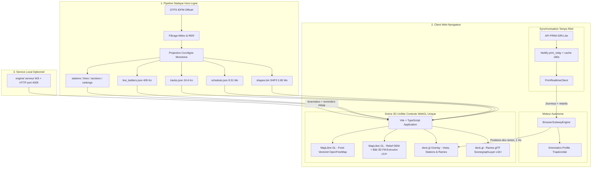

# 🏗️ Architecture Globale du Projet — Métro Parisien 3D

Ce document détaille l'architecture logicielle, les choix techniques fondamentaux, les flux de données et la stratégie de performance du visualiseur 3D du métro parisien.

---

## 1. Vision & Contraintes Fondatrices

### La problématique des données de transport à Paris
Contrairement aux réseaux ferroviaires néerlandais (ex: NS / treinen.pointful.com) ou suisses qui diffusent des coordonnées GPS en direct (`GTFS-RT VehiclePositions`), **la RATP et Île-de-France Mobilités ne diffusent aucune position GPS des rames de métro**.

Ce qui est publiquement disponible :
1. **Les horaires théoriques et tracés géométriques** : flux statique GTFS IDFM (~30 jours glissants).
2. **Les prochains passages estimés par station** : flux temps réel API PRIM (`SIRI-Lite EstimatedTimetable`), par arrêt, sans géolocalisation de véhicule.

### La solution architecturale
Pour offrir une expérience fluide affichant des centaines de rames en mouvement en temps réel, l'application met en œuvre une **simulation cinématique autonome in-browser** recalée en continu par les estimations de l'API PRIM :

---

## 2. Découpage par Modules & Responsabilités

### 1. Module d'Ingestion & Normalisation (`ingest/` & `scripts/`)
- **Rôle** : transformer le GTFS brut volumineux et complexe en artefacts hautement compressés, directement exploitables par le navigateur sans backend lourd.
- **Technologies** : Python 3, Shapely (géométrie vectorielle), SQLite (index relationnel), NumPy.
- **Artefacts produits** :
  - `lines.json` : **21 lignes** (16 lignes de métro + 5 lignes RER natives) avec identifiants, codes couleurs autoritaires et décalages altimétriques.
  - `stations.json` : **468 stations publiées** avec coordonnées WGS84, correspondances et rangs de desserte, dont 164 stations RER dans l'emprise filtrée. (Le fichier a absorbé les rangs de desserte : il est passé d'environ 70 Ko à environ 296 Ko.)
  - `shapes.bin` : format SHP2, origine `int32` et deltas `int16` quantifiés, avec pas et longueur de queue par tracé — 804 816 octets, plus une copie Brotli de 168 167 octets.
  - `tracks.json` : 24 polylignes dédupliquées, conservant les branches nécessaires (24 468 octets).
  - `schedule.json` : extraction des 11 252 courses actives de la journée parisienne (8 312 582 octets).
  - `line_ladders.json` : arborescence ordonnée des stations pour chaque ligne et terminus (419 226 octets).
  - `sections.json` : inventaire des sections aériennes / à fleur de sol / souterraines dérivé d'OSM, avec `aerial_sections`, `manual_review_sections` et `sections_by_line_direction`.
  - `station-rankings.json` : rangs de desserte par station (semaine / samedi / dimanche).
  - `rer_lines.json` + `rer_lines_meta.json` : tracés et métadonnées des 5 lignes RER natives.
  - `rolling-stock.json` : géométrie réelle du matériel roulant et table d'affectation par ligne.
  - `web/public/models/train/*.glb` : **2 modèles** de caisse — `pneumatic_generic__neutral.glb` et `steel_classic__neutral.glb` — générés *clean-room* par `scripts/build_train_box_models.py`. **Aucun modèle de monument n'existe plus.**

### 2. Moteur de Simulation Cinématique (`web/src/sim/`)
- **Rôle** : calculer à chaque seconde la position curviligne, la vitesse et le cap de chaque rame active.
- **Fichiers clés** :
  - `browser_engine.ts` : boucle cadencée à 1 Hz (`setInterval`) doublée d'une boucle d'interpolation `requestAnimationFrame` à 60 FPS, fusion des ticks, rames fantômes fondues en 240 ms.
  - `kinematics.ts` : interpolation par profil cinématique trapézoïdal (k = 25 % accélération, 50 % croisière, 25 % freinage) et lissage du cap sur ±30 m.
  - `shapes.ts` : découpe géométrique des tracés (`sliceShape`, `splitIntoCars`) utilisée par les capsules et les modèles.
  - `shapes_loader.ts` : décodeur `DataView` du buffer SHP2, mémoïsé au niveau module (`pending`) pour ne déclencher **qu'un seul** téléchargement de `shapes.bin` par session.
  - `paris_time.ts` : horloge civile de Paris (`Europe/Paris` via `Intl.DateTimeFormat`), incluant le traitement des heures GTFS ≥ 86 400 s pour les courses après minuit.
  - `prim_client.ts` : client HTTP interrogeant le relais PRIM et produisant les rapports de trafic par ligne.
  - `rt_matching.ts` : recalage des courses théoriques sur les passages réels et calcul des **quatre niveaux de confiance** (`measured`, `bracketed`, `extrapolated`, `scheduled`).
  - `rolling_stock.ts` : chargement de `rolling-stock.json`, fallback générique et calcul des centres de bogies (`getBogieCentresM`).

### 3. Scène Cartographique & Bâti 3D Unifié (`web/src/map/`)
- **Rôle** : rendu cartographique unifié haute performance sur un **seul contexte WebGL**.
- **Technologies** : MapLibre GL JS 5.24 (fond vectoriel OpenFreeMap, relief DEM, bâti 3D `fill-extrusion`) + deck.gl 9.1 / 9.4 (infrastructure métropolitaine et rames).
- **Couches & composants** :
  - `maplibre.ts` : création de la carte (`maxPitch: 60`, `maxZoom: 18`), contrôle d'attribution, montage du terrain, et politique d'inclinaison `maxPitchForZoom` (30° → 60° entre z14 et z16.5).
  - `vector_style.ts` : style sombre neutre (nom `Métro de Paris 3D — Noir Fonte Vectoriel`), 10 couches, sources `openmaptiles` + `terrain`, couche `building-3d` masquée par défaut.
    - `deck_overlay.ts` : gestionnaire de couches deck.gl synchronisé sur la caméra MapLibre via `MapboxOverlay` (`interleaved: false`), sélection de la stratégie de rendu des rames et utilitaires partagés (`hexToRgba`, `snapPointToPaths`). deck.gl ne fournit pas d'adaptateur `MapLibreOverlay` distinct.
  - `trains_layer.ts` : **marqueurs de repli** (`ScatterplotLayer` + `TrainMarker`) portant les 4 niveaux de confiance — ce n'est **pas** la capsule, contrairement à ce qu'indiquait la version précédente de ce document.
  - `capsule_layer.ts` : **capsule métrique** par découpe de tracé (`sliceShape` / `splitIntoCars`) — halo de contour, caisses, toitures, soufflets, phares/feux et étiquette de tête de rame.
  - `train_models_layer.ts` : modèles glTF (`ScenegraphLayer`) au-delà de `z > 16`, familles `pneumatic_generic` et `steel_classic`, désactivables via `?train-models=0`.
  - `train_model_geometry.ts` / `train_model_spike.ts` : géométrie et mode de diagnostic des modèles.
  - `train_render_fallback.ts` : arbitrage `modelLayers.length > 0 ? modelLayers : capsuleLayers`.
  - `labels_layer.ts` : étiquettes de stations (tassement glouton en pixels ; deck.gl v9 n'expose pas de filtre de collision pour `TextLayer`) avec paliers z12.5 / z14.

### 4. Interface Utilisateur & Navigation (`web/src/ui/` & `web/src/state/`)
- **`dock.ts`** : « Le Quai », volet latéral escamotable (desktop) et bottom sheet tactile (smartphone).
- **`header.ts`** : barre supérieure (marque, compteurs lignes/stations, distance de recherche, statut temps réel, bascule « Bâti 3D », menu déroulant Méthode / Records).
- **`station_ladder.ts`** : diagramme de marche vertical avec suivi des rames en approche et calcul de l'intervalle (*headway*).
- **`line_badge.ts`** : pastille de ligne et grille de badges, avec contrôle de contraste (`auditLineContrast`).
- **`search_bar.ts`** : champ de recherche de stations instantané avec autocomplétion floue (`⌘K`).
- **`chrome.css`** : habillage de l'ossature applicative (topbar, dock, modales).
- **`router.ts`** : gestion de l'historique de navigation HTML5 (`/ligne/:short_name?dir=:dir`) avec écoute `popstate` et réécriture Netlify `_redirects`.
- **Modales** : `openMethodologyModal()` (les 4 niveaux de méthode, les 4 badges de confiance, licences ODbL, clause de non-affiliation) et `openNetworkRecords()` (records de desserte semaine/samedi/dimanche).
- **`web/src/net/ws_client.ts`** : client WebSocket vers `engine/` — **présent mais non importé** (code mort, réservé au service local optionnel).

### 5. Service Local Optionnel (`engine/`)
- **Rôle** : exécuter la même cinématique côté serveur pour un usage hors navigateur (tests d'audit, vérification FPS, relais PRIM local).
- **Package** : `@paris-subway/engine` (dépendances `dotenv`, `ws`, `@paris-subway/shared`).
- **Fichiers** : `server.ts` (HTTP + WebSocket sur `PORT || 4000`, endpoint `/health`), `kinematics.ts`, `loader.ts`, `rt_siri.ts` (`PrimRealtimeClient`) et leurs équivalents compilés `.js`.
- **Table d'affectation** : correspondance IDFM → matériel roulant codée en dur (MP05, MF01, MF67, MP89, MP73, MF77, MF88, MP14).
- **Tests** : `engine/tests/` (audit des contrôles, benchmark FPS, vérification du relais PRIM, vérification du recalage temps réel, test de simulation) exécutés via `node --test`.
- Ce service **n'est pas déployé** : le site public tourne intégralement dans le navigateur.

### 6. Façade Serverless (`netlify/`)
- **`netlify/functions/prim_relay.ts`** : relais serveur vers l'API PRIM, avec cache de 180 s ; planifié toutes les 3 minutes (`*/3 * * * *`) pour réchauffer le cache et écrire `prim_delays.json`.
- **`netlify/functions/prim_delays.ts`** : simple ré-export de `prim_relay`.
- **Redirections** : `/api/prim` et `/api/prim_delays` → `/.netlify/functions/prim_relay` (200), puis `/*` → `/index.html` (200).

---

## 3. Stratégie de Performance & Optimisation Réseau

### 1. Suppression du GeoJSON brut (Gain : -9.3 Mo)
Le fichier initial `control_network.geojson` pesait environ **9,45 Mo**. Le rendu cartographique utilise désormais `tracks.json` (24,6 Ko), après simplification et suppression de 92 segments redondants sur 116; L14 est ramenée à un tracé, tandis que les branches L7/L13 sont conservées.

### 2. Contexte WebGL cartographique unique
Le rendu courant utilise MapLibre et deck.gl dans le pipeline cartographique publié. Aucun chunk Three.js ni second contexte WebGL n'est requis par le flux courant.

### 3. Extrusion Vectorielle Native GPU, Relief et glTF à la Demande (60 FPS)
Le bâti 3D parisien est généré à la volée par le moteur de tuiles vectorielles de MapLibre en un seul passage GPU via la primitive `fill-extrusion` : seuil `minzoom: 14`, opacité 0 → 0,28 → 0,70, hauteur par défaut de 18 m. Il est complété par un MNT raster monté en `setTerrain` (exagération 1,5) et n'est révélé qu'à la demande via le bouton « Bâti 3D ».

Les seuls assets glTF chargés sont les **deux caisses de matériel roulant** (`pneumatic_generic`, `steel_classic`), instanciées au-delà de `z > 16` puis répétées le long de l'abscisse curviligne par `ScenegraphLayer`. En dessous de ce seuil, le rendu retombe sur les capsules métriques deck.gl, ce qui garantit 60 FPS constants sans coût de maillage.

---

## 4. Sécurité & Bonnes Pratiques

- **Clés d'API & Secrets** : la clé d'API PRIM et les tokens de déploiement sont injectés via des variables d'environnement ou gérés dans des fichiers isolés exclus du contrôle de version git (`.gitignore`).
- **Isolation Sandbox** : les opérations d'ingestion et de build s'exécutent dans un environnement bac à sable local sécurisé.
- **Neutralisation des scripts tiers** : blocage strict des scripts d'injection publicitaire ou de widgets d'analytics invasifs au niveau du proxy et du DOM.
