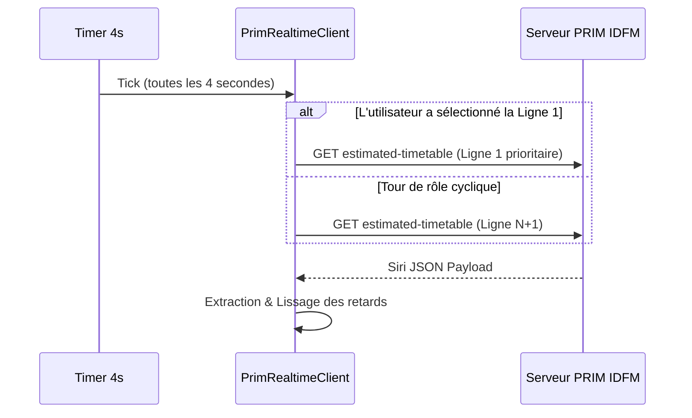

# 📡 Intégration du Temps Réel PRIM (Île-de-France Mobilités)

Ce document détaille l'intégration du flux temps réel officiel d'Île-de-France Mobilités via la plateforme PRIM (Plateforme Régionale d'Information pour la Mobilité), l'algorithme de Token Bucket pour la gestion des quotas, et le traitement des retards par sens de circulation.

---

## 1. Contexte & Nature des Données PRIM SIRI-Lite

L'API PRIM expose les prévisions de passage via le standard européen **SIRI-Lite** (Service Interface for Real-time Information).
- **Service interrogé** : `EstimatedTimetable` (horaires estimés par ligne).
- **Format** : JSON (ou XML).
- **URL type** :
  ```
  https://prim.iledefrance-mobilites.fr/marketplace/estimated-timetable?LineRef=STIF:Line::{line_id}:
  ```
- **En-tête requis** : `apikey: {votre_cle_api_prim}`.
- **Support CORS** : Les serveurs PRIM intègrent nativement l'en-tête `Access-Control-Allow-Origin: *`, autorisant des requêtes `fetch()` directes depuis le navigateur sans proxy serveur intermédiaire.

---

## 2. Régulation du Débit : L'Algorithme Token Bucket

Le quota gratuit PRIM impose une limite de **20 requêtes par minute**. Un dépassement entraîne une erreur HTTP 429 (*Too Many Requests*) et le blocage temporaire de la clé.

Le client [`PrimRealtimeClient`](file:///Users/morgancanteri/Documents/Paris%20subway%203D/web/src/sim/prim_client.ts) implémente un cadencement strict à **1 requête toutes les 4 secondes** (soit **15 requêtes / minute**, garantissant une marge de sécurité de 25 % sous le plafond autorisé) :



### Priorisation Intelligente de la Ligne Sélectionnée
Si l'utilisateur sélectionne une ligne dans « Le Quai » (ex: la ligne 14), le planificateur de requêtes lui accorde une priorité accrue en alternant une requête sur la ligne sélectionnée et une requête sur les autres lignes du réseau pour maintenir une fraîcheur optimale.

---

## 3. Extraction & Calcul Différencié des Retards par Sens

Dans une réponse `EstimatedTimetableDelivery`, chaque élément `EstimatedVehicleJourney` représente une course en cours. Pour chaque arrêt prévu (`EstimatedCall`) :

$$\Delta t = t_{\text{estimé}} - t_{\text{théorique}}$$

### Ségrégation par Sens de Circulation (`dir = 0` vs `dir = 1`)
Un incident voyageur ou un ralentissement ne touche souvent qu'un seul sens de la ligne (ex: vers *La Défense* alors que le trafic reste fluide vers *Château de Vincennes*).

L'attribut `DirectionRef` ou `DirectionName` est analysé pour classer les mesures :
```ts
const dirVal = String(j.DirectionRef?.value || '0').trim();
const dirKey = dirVal.includes('1') || dirVal.toLowerCase().includes('retour') ? '1' : '0';

dirDelays[dirKey].total += delayS;
dirDelays[dirKey].count++;
```

---

## 4. Lissage Exponentiel des Retards

Pour éviter que des à-coups ou des estimations erratiques d'une seule station ne fassent faire des bonds visuels aux rames sur la carte, un **filtre à réponse impulsionnelle infinie (lissage exponentiel)** est appliqué :

$$\text{retard}_{\text{lissé}}(t) = \alpha \times \text{retard}_{\text{mesuré}}(t) + (1 - \alpha) \times \text{retard}_{\text{lissé}}(t - 1)$$

Avec $\alpha = 0.35$ :
- Les variations progressives sont prises en compte en quelques secondes.
- Les bruits de mesure isolés sont immédiatement amortis.

---

## 5. Retour Visuel & Indicateur de Confiance

L'interface indique en temps réel l'origine de la position de chaque rame :

| Indicateur | Badge | Signification |
|---|:---:|---|
| **Bague or/ambre pulsante** | `PRIM SIRI-Lite` (Doré) | La rame bénéficie d'un recalage temps réel calculé depuis les estimations des serveurs IDFM. |
| **Bague blanche** | `Théorique GTFS` (Gris) | La rame circule selon l'horaire théorique officiel (avant le premier passage de la journée ou en l'absence temporaire de flux). |

### En-tête de Statut Réseau
L'indicateur pulsant dans l'en-tête informe l'utilisateur de l'état de la connexion :
- 🟢 **Vert (`PRIM Temps Réel`)** : flux actif et synchronisé (avec compteur des lignes surveillées).
- 🔴 **Rouge (`PRIM Hors Ligne`)** : quota dépassé ou indisponibilité momentanée des serveurs régionaux (l'application bascule alors de manière transparente et sans interruption sur la grille théorique).
