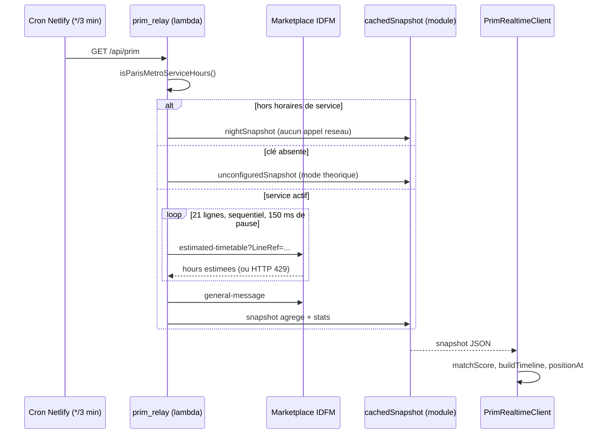

# 📡 Intégration du Temps Réel PRIM (Île-de-France Mobilités)

Ce document détaille l'intégration du flux temps réel officiel d'Île-de-France Mobilités via la plateforme PRIM (Plateforme Régionale d'Information pour la Mobilité) : régulation du débit face au quota, rapprochement course à course, reconstruction d'une chronologie corrigée et niveaux de confiance affichés à l'utilisateur.

---

## 1. Contexte & Nature des Données PRIM SIRI-Lite

L'API PRIM expose les prévisions de passage via le standard européen **SIRI-Lite** (Service Interface for Real-time Information). Deux services sont réellement consommés par le relais :

| Service | URL | Rôle |
|---|---|---|
| `estimated-timetable` | `https://prim.iledefrance-mobilites.fr/marketplace/estimated-timetable?LineRef=STIF:Line::{rawId}:` | Heures estimées par ligne → retards et positions |
| `general-message` | `https://prim.iledefrance-mobilites.fr/marketplace/general-message` | Information trafic : perturbations, stations fermées |

- **Format** : JSON, lus dans `Siri.ServiceDelivery.*Delivery[0]`.
- **En-tête requis** : `apikey: {PRIM_API_KEY}`.
- **Architecture** : le navigateur ne parle **jamais** à PRIM directement. Il lit le snapshot du relais Netlify (`/api/prim`) ; la clé reste dans les variables d'environnement du serveur.

### Portes de service et mode dégradé
Le relais applique deux garde-fous avant toute requête :

1. **Horaires de service parisiens** — `isParisMetroServiceHours()` : de **05:15** à **02:30** (heure de Paris, l'intervalle enjambant minuit). Hors de cette plage, le relais renvoie un `nightSnapshot` valide, sans appel réseau, avec `serviceActive: false` et des retards vides. Aucun quota n'est consommé pendant la fermeture du réseau.
2. **Clé absente** — si `PRIM_API_KEY` n'est pas configurée, le relais renvoie un `unconfiguredSnapshot` avec le message `PRIM_API_KEY non configurée côté serveur — mode 100% théorique actif`. L'application reste entièrement fonctionnelle en mode GTFS théorique.

### Les 21 lignes surveillées
La liste `METRO_RER_LINES` du relais contient exactement **21 entrées** : les 16 lignes de métro (`C01371`…`C01384`, plus `C01386` 3bis et `C01387` 7bis) et les 5 RER natifs (`C01742` A, `C01743` B, `C01727` C, `C01728` D, `C01729` E). Ce sont les mêmes identifiants que `lines.json` côté client.

---

## 2. Régulation du Débit : Appels Séquencés & Backoff Exponentiel

Le quota PRIM impose une limite de requêtes par minute ; un dépassement renvoie HTTP **429 Too Many Requests**. Le relais n'utilise **pas** de seau à jetons, mais une stratégie plus simple et plus prudente :

- **Balayage séquentiel** : les 21 lignes sont interrogées l'une après l'autre (jamais en parallèle) avec une pause de **150 ms** entre chaque appel.
- **Période pilotée par l'environnement** : `PRIM_POLL_INTERVAL_SECONDS`, valeur par défaut **180 s**. Le cron Netlify (`netlify.toml`, `*/3 * * * *`) rafraîchit donc le snapshot toutes les 3 minutes.
- **Backoff multiplicateur sur 429** : dès qu'un 429 est reçu, le relais interrompt immédiatement la boucle, double son multiplicateur (`backoffMultiplier`, plafonné à **×8**) et renvoie le dernier snapshot en le marquant `feedHealthy: false`. Le multiplicateur est remis à `1` dès qu'un cycle complet réussit.
- **Cache mémoire inter-invocations** : `cachedSnapshot` est conservé dans le module, ce qui le rend partagé entre lambdas « chaudes ». Un snapshot frais est resservi sans appel réseau.
- **Cache HTTP** : `Cache-Control: public, max-age=60, s-maxage={pollIntervalS}, stale-while-revalidate=300`, plus les en-têtes de diagnostic `X-Prim-Produced-At` et `X-Prim-Healthy`.

Des statistiques sont embarquées dans chaque snapshot : `linesQueried`, `linesSucceeded`, `totalJourneys`, `totalCalls`, `fetchDurationMs`.



### Côté client : `PrimRealtimeClient`
[`web/src/sim/prim_client.ts`](file:///Users/morgancanteri/Documents/Paris%20subway%203D/web/src/sim/prim_client.ts) interroge le snapshot toutes les **180 000 ms** et parcourt une chaîne de replis explicite :

```
/api/prim  →  /.netlify/functions/prim_relay  →  /.netlify/functions/prim_delays  →  /data/prim_delays.json
```

Le dernier maillon est le fichier statique versionné (`web/public/data/prim_delays.json`), qui garantit un affichage déterministe en l'absence de toute fonction serverless. Le client ne se déclare `active` que si le snapshot a moins de **10 minutes** et que `feedHealthy` est vrai.

---

## 3. Du Retard Moyen au Rapprochement Course à Course

### 3.1 Agrégat par sens (couche relais)

Dans une réponse `EstimatedTimetableDelivery`, chaque élément `EstimatedVehicleJourney` représente une course en cours. Pour chaque arrêt prévu (`EstimatedCall`) :

$$\Delta t = t_{\text{estimé}} - t_{\text{théorique}}$$

Un incident voyageur ou un ralentissement ne touche souvent qu'un seul sens de la ligne (vers *La Défense* alors que le trafic reste fluide vers *Château de Vincennes*). Le relais classe donc les mesures par sens :

```ts
const dirVal = String(j?.DirectionRef?.value || '0').trim();
const dir: '0' | '1' =
  dirVal.includes('1') || dirVal.toLowerCase().includes('retour') ? '1' : '0';
```

Les clés agrégées ont la forme `lineId#dir` (ex. `IDFM:C01384#1`). Ce **retard moyen par ligne et par sens** reste disponible dans `snapshot.delays` et sert de **repli** lorsque le rapprochement course à course échoue.

### 3.2 Rapprochement par course (`rt_matching.ts`)

Le client ne se contente pas du retard moyen : il rapproche chaque course du flux avec une course du GTFS via `matchScore()`. Le principe est de comparer les heures **théoriques** aux arrêts communs — c'est le seul point de contact fiable entre les deux référentiels, car les heures estimées portent précisément l'écart que l'on cherche à mesurer :

- incompatibilité immédiate si la ligne ou le sens diffèrent ;
- médiane des écarts aux arrêts communs, rejetée si elle dépasse `matchWindow = 120 s` ;
- score final = `médiane / √(nombre d'arrêts communs)`, ce qui récompense un rapprochement appuyé sur plusieurs arrêts ;
- affectation gloutonne : une course GTFS ne peut être prise qu'une seule fois (`usedJourneys`).

Les courses du flux restées non rapprochées sont exposées dans `unmatchedJourneys` et alimentent la détection de rames fantômes (§6).

---

## 4. Chronologie Corrigée & Lissage Exponentiel

`buildTimeline()` transforme les mesures brutes en une **chronologie corrigée** de toute la course, avec trois régimes par arrêt :

| Situation de l'arrêt | Écart appliqué |
|---|---|
| Arrêt mesuré par le flux | L'heure estimée est utilisée telle quelle |
| Arrêt situé **entre** deux arrêts mesurés | Interpolation linéaire de l'écart sur la distance (encadrement) |
| Arrêt situé **après** la dernière mesure | Décroissance linéaire de l'écart sur `decayDistance = 4 000 m` |
| Arrêt situé **avant** la première mesure | L'écart mesuré est reporté tel quel |

C'est là que se joue la fidélité du rendu : entre deux stations réellement observées, la rame n'est plus positionnée à partir d'un horaire théorique décalé, elle est **encadrée par deux observations réelles**.

Un **filtre à réponse impulsionnelle infinie (lissage exponentiel)** amortit ensuite les à-coups d'un rafraîchissement à l'autre :

$$\text{retard}_{\text{lissé}}(t) = \alpha \times \text{retard}_{\text{mesuré}}(t) + (1 - \alpha) \times \text{retard}_{\text{lissé}}(t - 1)$$

Avec $\alpha = 0{,}4$ (`CONFIG.alpha`), appliqué **par course** et non par ligne : les variations progressives sont intégrées en quelques cycles, les bruits de mesure isolés sont amortis.

### Garde-fous de la chronologie
- Toute mesure dont l'écart dépasse `maxDelay = 15 min` est jugée aberrante et **ignorée** (course probablement supprimée).
- Le temps de stationnement minimal est `minDwell = 20 s` si le GTFS n'en fournit pas.
- Une passe de **monotonie** garantit qu'une rame ne recule jamais, même après interpolation : `cArr[i] ≥ cDep[i-1] + 1 s`.

### Paramètres complets de `CONFIG`

| Clé | Valeur | Rôle |
|---|---|---|
| `matchWindow` | 120 s | Fenêtre de rapprochement sur l'heure théorique |
| `maxDelay` | 900 s | Au-delà, la mesure est aberrante et ignorée |
| `alpha` | **0,4** | Coefficient du lissage exponentiel par course |
| `decayDistance` | 4 000 m | Distance de décroissance de l'écart après la dernière mesure |
| `staleAfter` | 360 s | Au-delà, la chronologie n'est plus considérée comme fraîche |
| `accel` / `decel` | 1,0 / 1,2 m·s⁻² | Profil trapézoïdal du moteur |
| `vMax` | 19,4 m·s⁻¹ (~70 km/h) | Plafond de vitesse du profil |
| `minDwell` | 20 s | Stationnement minimal |

---

## 5. Quatre Niveaux de Confiance (`Confidence`)

`confidenceFor()` attribue à chaque position l'un de quatre niveaux :

| Niveau | Condition | Signification |
|---|---|---|
| `measured` | Les **deux** arrêts encadrant la position sont mesurés | Position encadrée par deux observations réelles |
| `bracketed` | **Un seul** des deux arrêts encadrants est mesuré | Position contrainte par une observation |
| `extrapolated` | Aucun des deux, mais la course a déjà été mesurée | Prolongement du retard connu |
| `scheduled` | Aucune mesure, ou dernière mesure plus vieille que `staleAfter` (6 min) | Horaire théorique pur |

### Traduction visuelle

| Indicateur | Badge `PRIM SIRI-Lite` (or) | Badge `Théorique GTFS` (gris) |
|---|---|---|
| Conditions | `measured` ou `bracketed` | `extrapolated` ou `scheduled` |
| Bague de la capsule | Halo **or** `[255, 215, 0, 255]` | Halo **blanc** `[240, 240, 240, 240]` |
| Détail supplémentaire | — | Style de trait pointillé `[3, 2]` lorsque le niveau est `scheduled` (voir [3D_RENDERING.md](3D_RENDERING.md) §2.3) |

Les couleurs de caisse suivent par ailleurs `getNeutralBodyColor()`, qui garantit un contraste ≥ 3 quel que soit le fond.

### En-tête de Statut Réseau
L'indicateur dans l'en-tête (`rtStatusEl` / `rtLabelEl`) informe de l'état de la connexion :
- 🟢 **`PRIM Temps Réel`** : snapshot frais (< 10 min), `feedHealthy` vrai, compteur des lignes surveillées affiché.
- 🔴 **`PRIM Hors Ligne`** : quota dépassé, clé absente, hors horaires de service ou indisponibilité momentanée. L'application bascule alors de manière transparente et sans interruption sur la grille théorique — aucune rame ne disparaît de la carte.

---

## 6. Rames Fantômes (`GhostTracker`)

Une course déjà rapprochée qui **disparaît** du flux alors que celui-ci est sain a probablement été supprimée (incident, service partiel). Si le moteur continuait à la faire rouler, il afficherait une rame qui n'existe pas : c'est une *rame fantôme*, plus trompeuse qu'un retard approximatif.

`GhostTracker` compte les concédés consécutifs sans mesure par `tripId` et applique deux garde-fous :

1. **ne rien conclure si le flux est en panne** (`feedHealthy === false`) — une absence de mesure globale n'est pas une suppression ;
2. **ne rien conclure d'une course jamais rapprochée** — l'absence de mesure peut simplement venir d'un arrêt non sondé par PRIM.

---

## 7. Information Trafic (`general-message`)

Le relais interroge en parallèle `general-message` et remplit `trafficByLine`. Les messages sont classés par `MessageType` et `Impact`, et le contenu textuel est analysé pour extraire les **stations fermées** (motif `interrompu entre X et Y`). Chaque ligne dispose ainsi d'un état de trafic indépendant du calcul des retards, lequel reste purement horaire.
